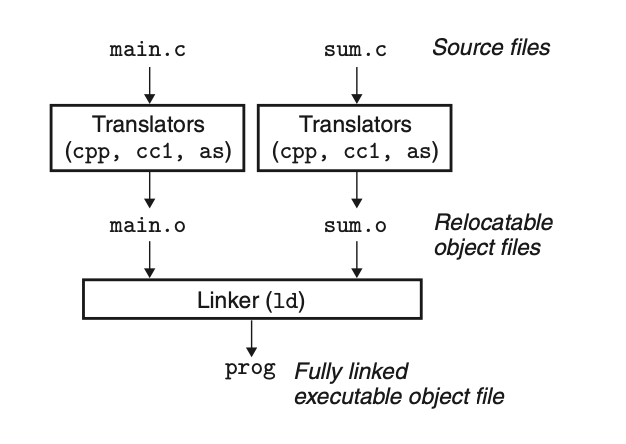

## The 4 processes of GCC compiling 

The 4 processes of GCC compiling were **preprocess -> compile -> assemble -> link**.

Consider the C program in the following. It will serve as a simple running example throughout this chapter that will allow us to make some important points about how linkers work.

main.c
```c
int sum(int *a, int n);
int array[2] = {1, 2};
int main(){
	int val = sum(array, 2);
	return val;
}
```

sum.c
```c
int sum(int *a, int n){
	int i, s=0;
	for(i=0;i<n;i++){ 
		s += a[i];
	}
	return s;

}
```

Most compilation systems provide a compiler driver that invokes the language preprocessor, compiler, assembler, and linker, as needed on behalf of the user. For example, to build the example program using the GNU compilation system, we might invoke the gcc driver by typing the following command to the shell:
```
 gcc -Og -o prog main.c sum.c
```

The following figure summarizes the activities of the driver as it translates the example program from an ASCII source file into an executable object file. (If you want to see these steps for yourself, run gcc with the -v option.) 



** 1) preprocess **  
The driver first runs the C preprocessor (cpp), which translates the C source file main.c into an ASCII intermediate file main.i:
```
cpp [other arguments] main.c main.i
```
or
```
gcc -E main.c -o main.i
```
In this stage, the compiler will combin the header files link stdio.h into the targe file.

** 2) compile **  
Next, the driver runs the C compiler (cc1), which translates main.i into an ASCII assembly-language file main.s:
```
cc1 /tmp/main.i -Og [other arguments] -o main.s
```
or
```
# -Og 是为了生成未经优化的与原代码结构相符的汇编代码
gcc -Og -S main.i -o main.s
```
You can also generate assmbly-languange from C file directly
```
gcc -Og -S main.c -o main.s  
```
** 3) assemble **  
Then, the driver runs the assembler (as), which translates main.s into a binary relocatable object file main.o:
```
as [other arguments] -o main.o main.s
```
or
```
gcc -c main.s -o main.o
```
The driver goes through the same process to generate sum.o. 

** 4) link **  
Finally, it runs the linker program ld, which combines main.o and sum.o, along with the necessary system object files, to create the binary executable object file prog:
```
ld -o prog [system object files and args] main.o sum.o
```
or
```
gcc main.o sum.o -o prog
```
** 5) run **  
To run the executable prog, we type its name on the Linux shell’s command
line:
```
./prog
```  
The shell invokes a function in the operating system called the loader, which copies the code and data in the executable file prog into memory, and then transfers control to the beginning of the program.


## GCC Options

| Options       | Description    |  
|:------------- |:---------------| 
| -c     | 只编译不链接，生成*.o文件| 
|  -S  |  生成汇编代码*.s文件  |
|  -E  |   预编译 生成*.i文件 |
|  -g  |   在可执行程序里包含了调试信息，可用 gdb 调试 |
| -o   |  把输出文件输出到指定文件里  |
|  -O  |  生成汇编代码的优化级别, -Og保持与原代码结构一样，-O1 -O2 依次对应更高的优化级别  |

 