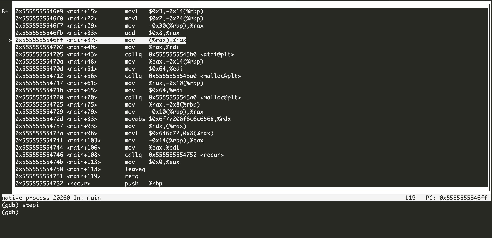

		

## Source Code

map.c
```c
#include <stdio.h>
#include <stdlib.h>

/* A statically allocated variable */
int foo;

/* UNCOMMENT THIS LINE for 3.4.3*/
extern int recur(int i);


/* A statically allocated, pre-initialized variable */
volatile int stuff = 7;

int main(int argc, char *argv[]) {
    /* A stack allocated variable */
    volatile int n = 3;

    int arr[] = {1, 2, 3, 4, 5};
    
    if(argc=2)  
      n = atoi(argv[1]);

    /* Dynamically allocate some stuff */
    char *buf1 = malloc(100);
    /* ... and some more stuff */
    volatile char *buf2 = malloc(100);

    sprintf(buf1, "hello world");
    recur(n);
    return 0;
}

```

recurse.c

```c
#include <stdio.h>

int recur(int i) {
    /* A stack allocated variable within a recursive function */
    int j = i;
    printf("%i\n", i);

    if (i > 0) {
        return recur(i - 1);
    }

    return 0;
}

```

## Compiling
You have to tell your compiler to compile your code with symbolic debugging information included. Here's how to do it with gcc, with the -g switch:

```
gcc -g map.c recurse.c -o map
```

## Starting The Debugger
To start the gdb and pass arguments, type the command in the terminal
```
gdb --args <program> <args...>
```
If the program has no arguments, just type 

```
gdb  <program>
```
Fot this demo, we launch a program called map in the debugger and pass argument 5.
```
$ gdb --args map 5
```
## Breakpoints

### Break point
 To set a new breakpoint, You use the break or b command, and specify a location, which can be a function name,  line number, or source file:line number.
```
break <where>
```

Where

* line_number
* function_name
* file:line_number/function_name

For this demo, let's set a breakpoint at main(), and start the program:


```
(gdb) break main
Breakpoint 1 at 0x6e9: file map.c, line 18.
```

when you type `run` command , program will suspend at the first break point it encounter.
```
(gdb) run
Starting program: /home/vagrant/code/personal/hw-intro/map 5

Breakpoint 1, main (argc=2, argv=0x7fffffffe3a8) at map.c:18
18	    if(argc<2) n= 3;
(gdb) 
```


### Condition break point
```
break <where> if <condition> 
```
Break at the given location if the condition is met. Conditions may be almost any C expression that evaluate to true or false.


```
(gdb) break recur if i==1
Breakpoint 2 at 0x55555555475e: file recurse.c, line 5.
(gdb) continue
Continuing.

Breakpoint 2, recur (i=1) at recurse.c:5
5	    int j = i;
(gdb) print i
$1 = 1
```

### Set/change the condition 

```
condition <breakpoint#> <condition> 
```
Set/change the condition of an existing breakpoint.
```
(gdb) condition 2 i==0
```


## Watchpoints

```
watch <expression>
```

Note that watch takes an expression as an argument, so you can put a variable name in there, or something more complex like `*(p+5)` or `a[15]`

watchpoints are special breakpoints that will trigger whenever an expression changes. Often you just want to know when a variable changes (is written to), and for that you can use the watch command:

```
(gdb) watch n
Hardware watchpoint 2: n
(gdb) next

Hardware watchpoint 2: n

Old value = 21845
New value = 3
main (argc=2, argv=0x7fffffffe3a8) at map.c:18
18	    if(argc=2)  
(gdb) 
19	      n = atoi(argv[1]);
(gdb) 

Hardware watchpoint 2: n

Old value = 3
New value = 5
main (argc=2, argv=0x7fffffffe3a8) at map.c:22
22	    char *buf1 = malloc(100);
(gdb) 
```


## Stepping

### Next statement

Step N statements, proceeding through subroutine calls.
```
next [N]
```

Unlike "step", if the current source line calls a subroutine,
this command does not enter the subroutine, but instead steps over
the call, in effect treating it as a single source line.

```
(gdb) next
19	    else n = atoi(argv[1]);
(gdb) 
```
Hitting Enter key will repeat the last command, this will save you typing `next` over and over again.


### Step into subroutine
```
step [N]
```

Step statement, if it's a subroutine call it will enter into the subroutine.

```
27	    recur(n);
(gdb) step 
recur (i=5) at recurse.c:5
5	    int j = i;
(gdb) 
```

### finish

```
finish
```
Continue until the current function returns.

### continue

```
continue
```
Continue normal execution until the end of programe or the next breakpoint.


### Advance
```
advance <where>
```

To continue to a specific location, use the advance command, specifying a location like those shown in the "Breakpoints" section, above. Here's an example which advances from the current location until the function "recur()" is called:

```
(gdb) advance recur
recur (i=5) at recurse.c:5
5	    int j = i;
(gdb) 
```
advance is just shorthand for "continue to this temporary breakpoint."


### Next instruction
```
nexti [N]
```
Step a single assembly instruction, but proceed through subroutine calls.

### Step instruction
```
stepi [N]
```
Step a single assembly. It means that if it's a subroutine call it will enter into the function.


## Examining Variables and memory

### Print Variables

Print content of variable/memory location/register.
```
print/format <what>
```

Format  

* a: Pointer.
* c: Read as integer, print as character. d Integer, signed decimal.
* f: Floating point number.
* o: Integer, print as octal.
* s: Try to treat as C string.
* t: Integer, print as binary (t = "two“).
* u: Integer, unsigned decimal.
* x: Integer, print as hexadecimal.


What

* "expression" Almost any C expression, including function calls (must be prefixed with a cast to tell GDB the return value type).
* "file_name::variable_name" Content of the variable defined in the named file (static variables).
* "function::variable_name" Content of the variable defined in the named function (if on the stack).
* "{type}address" Content at address, interpreted as being of the C type type.
* "$register" Content of named register. Interesting registers are $esp (stack pointer), $ebp (frame pointer) and $eip (instruction pointer).


```
(gdb) print n
$1 = 5
(gdb) print/t n
$2 = 101
```

printf
```
(gdb) printf "%08X\n", n
00000005
```

### Print Array
```
print *array@len
```

Print the first 3 elements of the Array
```
(gdb) print arr[0]@3
$4 = {1, 2, 3}
```

### Display Variables
```
display/format <what>
```
Like `print`, but print the information after each stepping instruction.

For this demo

```
(gdb) display i
1: i = 5
(gdb) next
6	    printf("%i\n", i);
1: i = 5
(gdb) next
5
8	    if (i > 0) {
1: i = 5
```

### Examining Memory

```
x/nfu <address> 

```
* n: How many units to print (default 1). 
* f: Format character (like „print“).
* u: Unit.  
		   Unit is one of:   
			 b: Byte  
			 h: Half-word (two bytes)  
			 w: Word (four bytes)  
			 g: Giant word (eight bytes)).  

For this demo,

```
(gdb) x buf1
0x555555756260:	"hello world"
(gdb) x/11x buf1
0x555555756260:	0x68	0x65	0x6c	0x6c	0x6f	0x20	0x77	0x6f
0x555555756268:	0x72	0x6c	0x64
```

## Examining the call stack
Show call stack.
```
backtrace [full]
```

The command `backtrace` (or `bt`) will show you the current function call stack, with the current function at the top, and the callers in order beneath it:

Use of the 'full' qualifier also prints the values of the local variables.


```
(gdb) backtrace
#0  recur (i=3) at recurse.c:5
#1  0x0000555555554832 in recur (i=4) at recurse.c:9
#2  0x0000555555554832 in recur (i=5) at recurse.c:9
#3  0x00005555555547dd in main (argc=2, argv=0x7fffffffe3a8) at map.c:29

```

## directory
```
directory <directory>
```
Add directory to the list of directories that is searched for sources.

## Listing Source Code
```
list
list <filename>:<function> 
list <filename>:<line_number> 
list <first>,<last>
```

Shows the current or given source context. The filename may be omitted. If last is omitted the context starting at start is printed instead of centered around it.

```
(gdb) list
22	    char *buf1 = malloc(100);
23	    /* ... and some more stuff */
24	    volatile char *buf2 = malloc(100);
25	
26	    sprintf(buf1, "hello world");
27	    recur(n);
28	    return 0;
29	}
```

## Call function
```
call functionName(args...)
```
execute arbitrary function and print the result.
```
(gdb) call recur(3)
$1 = 0
```

## Informations

* info breakpoints: Print informations about the breakpoints and watchpoints.
* info registers: Print values of all registers.
* info args: Print the arguments to the function of the current stack frame.
* info display: Print informations about the „displays“.
* info locals: Print the local variables in the currently selected stack frame.
* info sharedlibrary: List loaded shared libraries.
* info signals: List all signals and how they are cur- rently handled.
* info threads: List all threads.

## Disassemble
Disassemble the current function or given location.
```
disassemble <where>
```
For this demo, I have enter into recur function, then I execute `disassemble`, gdb print out the assembly code of this "recur" function.

```
(gdb) disassemble
Dump of assembler code for function recur:
   0x00005555555547f8 <+0>:	push   %rbp
   0x00005555555547f9 <+1>:	mov    %rsp,%rbp
   0x00005555555547fc <+4>:	sub    $0x20,%rsp
   0x0000555555554800 <+8>:	mov    %edi,-0x14(%rbp)
=> 0x0000555555554803 <+11>:	mov    -0x14(%rbp),%eax
   0x0000555555554806 <+14>:	mov    %eax,-0x4(%rbp)
   0x0000555555554809 <+17>:	mov    -0x14(%rbp),%eax
   0x000055555555480c <+20>:	mov    %eax,%esi
   0x000055555555480e <+22>:	lea    0xaf(%rip),%rdi        # 0x5555555548c4
   0x0000555555554815 <+29>:	mov    $0x0,%eax
   0x000055555555481a <+34>:	callq  0x5555555545f0 <printf@plt>
   0x000055555555481f <+39>:	cmpl   $0x0,-0x14(%rbp)
   0x0000555555554823 <+43>:	jle    0x555555554834 <recur+60>
   0x0000555555554825 <+45>:	mov    -0x14(%rbp),%eax
   0x0000555555554828 <+48>:	sub    $0x1,%eax
   0x000055555555482b <+51>:	mov    %eax,%edi
   0x000055555555482d <+53>:	callq  0x5555555547f8 <recur>
   0x0000555555554832 <+58>:	jmp    0x555555554839 <recur+65>
   0x0000555555554834 <+60>:	mov    $0x0,%eax
   0x0000555555554839 <+65>:	leaveq 
   0x000055555555483a <+66>:	retq   
End of assembler dump.

```


## Layout

* `layout src`	Standard layout—source on top, command window on the bottom
* `layout asm`	Just like the "src" layout, except it's an assembly window on top
* `layout split`	Three windows: source on top, assembly in the middle, and command at the bottom
* `layout reg`	Opens the register window on top of either source or assembly, whichever was opened last
* `tui reg general`	Show the general registers
* `tui reg float`	Show the floating point registers
* `tui reg system`	Show the "system" registers
* `tui reg next`	Show the next page of registers—this is important because there might be pages of registers that aren't in the "general", "float", or "system" sets

For this demo, when you type `layout asm` command ,you will see the interface as following


In asm layout , we can use `nexti` or `stepi`   command to step to the next asm instruction

## Help
`help command`	Get help on a certain command
For example
```
help breakpoint 
```


## GDB dashboard

[GDB dashboard](https://github.com/cyrus-and/gdb-dashboard) is a standalone ".gdbinit" file. 
Just place ".gdbinit" in your home directory or project directory, for example with:
```
wget -P ~ https://git.io/.gdbinit
```
Then debug as usual, the dashboard will appear automatically every time the inferior program stops.

Optionally install Pygments to enable syntax highlighting:
```
pip install pygments
```

If it has no effect, execute the following command in the terminal
```
set auto-load local-gdbinit on
```

## Some other commands


> [https://beej.us/guide/bggdb](https://beej.us/guide/bggdb)  
  [https://wiki.ubuntu.org.cn/用GDB调试程序](https://wiki.ubuntu.org.cn/用GDB调试程序)  
  [http://www.unknownroad.com/rtfm/gdbtut/gdbtoc.html](http://www.unknownroad.com/rtfm/gdbtut/gdbtoc.html)  
  [Official documentation](https://sourceware.org/gdb/current/onlinedocs/gdb/)
