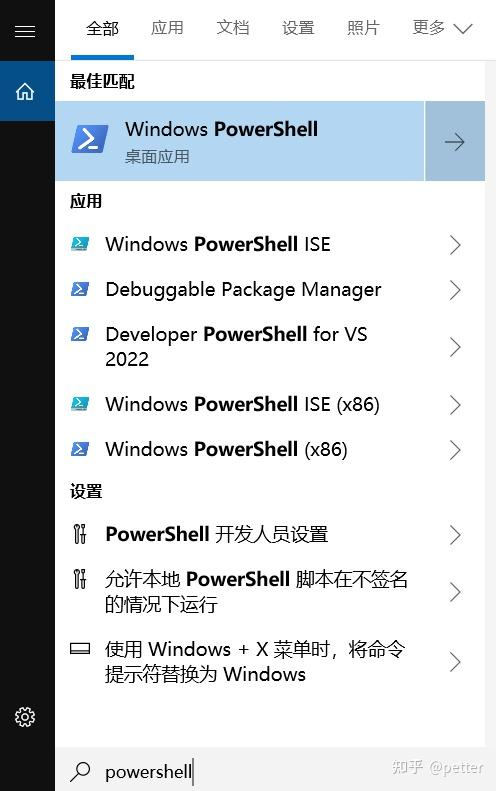

>https://zhuanlan.zhihu.com/p/6823352707

**安全提示：**激活方法来源于网络，属于github上的MAS开源项目，谨慎激活。安全问题请自行斟酌，注重安全的小伙伴们请购买正版。

`MAS`作为一个开源免费的激活工具，以其安全性、易用性和强大的功能受到了用户的青睐。它不仅提供了多种激活方式，还考虑到了用户的不同需求，如永久激活和临时激活。此外，MAS的开源特性也让用户可以更加放心地使用，因为源代码的透明度可以确保没有隐藏的安全风险。

项目网址：[https://massgrave.dev/](https://massgrave.dev/)

**一、在线激活方法**

**PowerShell激活（win8及以上版本）**

1.  打开 PowerShell (不是 CMD). 搜索框输入PowerShell,然后打开


2. 复制一下代码到命令行，按回车键
```sh
irm https://get.activated.win | iex
```

3. 你会看到激活选项。选择[1] [HWID](https://zhida.zhihu.com/search?content_id=250387047&content_type=Article&match_order=1&q=HWID&zhida_source=entity) 用于 Windows 激活。选择[2] [Ohook](https://zhida.zhihu.com/search?content_id=250387047&content_type=Article&match_order=1&q=Ohook&zhida_source=entity) 用于 Office 激活

4. 输入`1` 激活windows系统。

**二、离线激活方法：**

1、下载下面链接的文件

https://git.activated.win/massgrave/Microsoft-Activation-Scripts/archive/master.zip

2、解压文件

3、在文件夹中找到名字为All-In-One-Version-KL的文件夹

4、右键，以管理员运行 `MAS_AIO.cmd`文件

5、会看到激活选项，和上面的在线激活界面一样了


**三、卸载激活方法**

以管理身份运行Windows PowerShell

要卸载已激活的 Windows 系统，但不卸载序列号，您可以使用以下命令。这些命令主要用于取消 Windows 的激活，同时保持序列号在系统中的可用状态。

**1、取消激活产品密钥：**

```bash
slmgr /upk  
```

  
这个命令将卸载产品密钥，但会使 Windows 系统处于未激活状态。

**2、清除 [KMS 服务器](https://zhida.zhihu.com/search?content_id=250387047&content_type=Article&match_order=1&q=KMS+%E6%9C%8D%E5%8A%A1%E5%99%A8&zhida_source=entity)信息（如果使用 KMS 激活）：**

```bash
slmgr /ckms  
```

  
该命令会清除 KMS 服务器的地址，这在您的系统使用 KMS 激活时非常有用。

**3、重启激活计数器：**

```text
slmgr /rearm  
```
  
这个命令会重置激活状态以及在非企业版中可以激活的次数，但有些情况下，这个命令并不会给已卸载的密钥带来任何影响。  
  
使用这些命令后，系统会变为未激活状态，但您的产品密钥不会被移除，只是被“卸载”了。 如果您想要通过激活相同的密钥后续使用，还可以在需要时再次输入该密钥。  
  
请确保在使用这些命令时，以管理员身份运行命令提示符。执行后，重新启动计算机会生效更改。