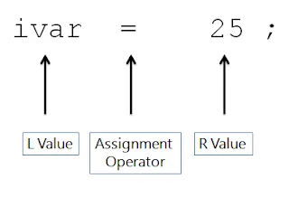

First we should look at the concepts of “Rvalue” and “LValue”.

An Rvalue (short for “right value”) is a temporary value that is usually created and used immediately. In C++, Rvalues are expressions that are not associated with a memory location, meaning they do not have an address and cannot be modified. Examples of Rvalues include numeric literals, such as 5 or 3.14 , and temporary objects created by expressions like std::string(“hello).

In contrast, an Lvalue (short for “left value”) refers to an object that occupies some identifiable location in memory. This includes variables, dereferenced pointers, and elements of arrays. Lvalues can be used to assign a new value or to take the address of the object.



##  Rvalue reference and Lvalue Reference
```c++
int& lref; /* ----> Lvalue Ref */  
int&& rref /* ----> Rvalue Ref */
```


```c++
#include <iostream>  
  
void bar(int& lref) {  
  std::cout << "Lvalue reference" << std::endl;  
}  
  
void bar(int&& rref) {  
  std::cout << "Rvalue reference" << std::endl;  
}  

/**
 * Universal References: Enables the use of universal references (`T&&`) to     accept both lvalues and rvalues
 */
template<typename T>  
void foo(T&& param) {  
  bar(std::forward<T>(param));  
}  
  
int main() {  
  int x = 5;  
  
  foo(x); // lvalue reference  
  foo(20); // rvalue reference  
  
  return 0;  
}
```

We have one more topic before our main topic. Perfect Forwarding

## Perfect Forwarding

Perfect forwarding is a C++ technique that allows a function template to forward its arguments exactly as they were passed, including their value category (whether they are Lvalues or Rvalues). This enables functions to accept arguments and pass them along to another function without losing their value category, constness, or reference qualifiers.

Perfect forwarding is typically used with templated functions, especially in combination with variadic templates, to create functions that can accept any type of argument and forward it to another function with the same type and value category. This is particularly useful for writing generic code, such as wrapper functions or factory functions, that needs to pass arguments to other functions without knowing their exact types in advance.

Well, now we can start our topic;

### std::move

std::move is a utility function in C++ that performs a cast to an Rvalue reference, allowing you to convert an Lvalue into an Rvalue. This is useful in situations where you want to transfer **ownership** or enable **move semantics** for an object. Move semantics allow you to efficiently transfer resources (like memory or file handles) from one object to another without unnecessary copying.

As you know, move semantics allow objects to be efficiently “moved” from one location to another, rather than copied. This is particularly useful for objects that manage resources, such as dynamically allocated memory or file handles.

std::move is a cast that converts its argument into an Rvalue reference, indicating that it can be safely moved from. It does not actually move anything; it just changes the type of the expression to an Rvalue reference. This allows move constructors or move assignment operators to be called instead of the copy constructor or copy assignment operator.

std::move is commonly used when implementing move constructors and move assignment operators, as well as when passing objects to functions that take Rvalue references. It allows you to take advantage of move semantics to improve performance in situations where copying is expensive or unnecessary.

> std::move always casts the input object into an rvalue reference regardless of the value category of the object

```c++
#include <iostream>
#include <utility>

class MyObject {
public:
    MyObject()
    {
        std::cout << "Default constructor\n";
    }

    MyObject(const MyObject&)
    {
        std::cout << "Copy constructor\n";
    }

    MyObject(MyObject&&) noexcept
    {
        std::cout << "Move constructor\n";
    }

    MyObject& operator=(MyObject&& other) noexcept
    {
        std::cout << "Move assignment operator\n";
        /* Copy the resources from 'other' to 'this' */
        // Assume this involves transferring ownership of some resource
        return *this;
    }

};

int main() {
    MyObject obj1;                   /* Default constructor */
    MyObject obj2 = std::move(obj1); /* Move constructor    */
    MyObject obj3;
    obj3 = std::move(obj2);          /* Move assignment operator */
    return 0;
}
```

1. obj1 is created and the default constructor is called.
2. obj2 is created by moving obj1 using std::move, which calls the move constructor.
3. obj3 is created and the default constructor is called.
4. When obj2 is moved to obj3 using std::move, the move assignment operator is called.

In this example, std::move initiates the move operations for obj1 to obj2 and for obj2 to obj3. This can improve performance, especially when moving large data structures or resources. However, it's important to pay attention to the state of the moved objects and the resources they own.

Here is another example about transfer **ownership:**

```c++
#include <iostream>
#include <memory>

class MyClass {
public:
    MyClass() {
        std::cout << "MyClass constructed\n";
    }

    ~MyClass() {
        std::cout << "MyClass destructed\n";
    }

    void doSomething() {
        std::cout << "MyClass is doing something\n";
    }
};

int main() {
    std::unique_ptr<MyClass> ptr1 = std::make_unique<MyClass>(); /* ptr1 takes ownership of the MyClass object */

    std::unique_ptr<MyClass> ptr2 = std::move(ptr1); /* ptr2 takes ownership from ptr1, ptr1 is now empty */

    if (ptr1) {
        std::cout << "ptr1 is not empty\n"; /* This line will not be executed because ptr1 is now empty */
    }

    ptr2->doSomething(); /* ptr2 still owns the MyClass object, so it can be used */

    return 0;
}
```

It creates two unique pointers, ptr1 and ptr2, and transfers ownership from ptr1 to ptr2 using std::move . After the transfer, ptr1 becomes empty (nullptr), and ptr2 owns the object. The code also shows that attempting to use ptr1 after the transfer will not work, as ptr1 is now empty.

### std::forward

==std::forward is a utility function in C++ that is used to forward arguments exactly as they were passed to a function. It is typically used in template functions  where you need to forward arguments with their original value category, especially in the implementation of forwarding references (also known as universal references)

==The purpose of std::forward is to preserve the value category (lvalue or rvalue) of the argument that is passed to a function template, allowing perfect forwarding. This means that if an rvalue is passed to a function, std::forward will cast it to an rvalue reference, and if an lvalue is passed, it will cast it to an lvalue reference. This helps in forwarding arguments to another function while preserving their value category.

==Enables the use of universal references (`T&&`) to accept both lvalues and rvalues. Without `std::forward`, universal references would always be treated as lvalues inside the function body, losing the opportunity for move semantics and potentially causing unnecessary copies.

```c++
#include <iostream>
#include <utility>

void inner(int&& x)
{
    /* with rvalue reference */
    std::cout <<" RValue X: "<<x<<"\n";
}

void inner(const int& x)
{
    /* const lvalue reference */
    std::cout <<" LValue X: "<<x<<"\n";
}

/**
 * Universal References: Enables the use of universal references (`T&&`) to     accept both lvalues and rvalues
 */
template <typename T>
void wrapper(T&& arg)
{
    /* Forward 'arg' exactly as it was passed to 'inner' */
    inner(std::forward<T>(arg));
}

int main() {
    int x = 4;
    wrapper(x);     /* 'x' is an lvalue, forwarded as an lvalue */
    wrapper(42);    /* '42' is an rvalue, forwarded as an rvalue */
}
```
When wrapper() is called with an lvalue (x), it forwards arg as an lvalue, and when called with an rvalue (42), it forwards arg as an rvalue. This behavior ensures that inner receives its argument with the correct value category.

##  std::forward vs std::move

```c++
#include <iostream>

/* This function takes an lvalue reference */
void inner(int& a) {
    std::cout << "int&: " << a << std::endl;
}

/* This function takes an rvalue reference */
void inner(int&& a) {
    std::cout << "int&&: " << a << std::endl;
}

/* This function calls inner with std::move, converting the argument to an rvalue reference */
template <typename T>
void wrapper1(T&& a) {
    inner(std::move(a));
}

/* This function calls inner with std::forward, preserving the argument's original value category */
template <typename T>
void wrapper2(T&& a) {
    inner(std::forward<T>(a));
}

int main() {
    int arg = 10;

    std::cout << "Calling wrapper1 with std::move()..." << std::endl;
    wrapper1(arg); /* arg is an lvalue */
    wrapper1(25);  /* 25 is an rvalue  */

    std::cout << "Calling wrapper2 with std::forward()..." << std::endl;
    wrapper2(arg); /* arg is an lvalue */
    wrapper2(25);  /* 25 is an rvalue  */

    return 0;
}
```

Here’s a description of each part:

- **inner(int& a) and inner(int&& a)**: These are overloaded functions. The first one takes an lvalue reference (int&)and the second one takes an rvalue reference (int&&). They print the value of the argument to the console along with the reference type.
- **wrapper1(T&& a):** This function is a template that takes a universal reference (T&&). Inside the function, it calls equivalent with std::move(a), which converts a to an rvalue reference. This means that if a is an lvalue, it will be treated as an rvalue when passed to equivalent.
- **wrapper2(T&& a):** Similar to wrapper1, this function also takes a universal reference (T&&). However, it uses std::forward to preserve the original value category of a. This means that if a is an lvalue, it will be passed as an lvalue to equivalent, and if it's an rvalue, it will be passed as an rvalue.
- In main(), the functions wrapper1 and wrapper2 are called with both lvalue and rvalue arguments to demonstrate their behavior.

## Let’s compare std::forward and std::move briefly:

**Purpose:**

- **std::forward:** Used to forward arguments exactly as they were passed, preserving their value category (lvalue or rvalue).
- **std::move:** Used to cast a value to an rvalue, typically to enable the move semantics(move construct, move assignment) and transfer ownership.

**Usage:**

- **std::forward:** Typically used in forwarding references (universal references) to preserve the value category of arguments passed to another function.
- **std::move:** Used to explicitly cast an object to an rvalue, indicating that it can be moved from.

**Effect:**

- **std::forward:** Does not change the value category of the argument. It returns an rvalue reference if the original argument was an rvalue reference, and an lvalue reference otherwise.
- **std::move:** Casts its argument to an rvalue reference, changing its value category to an rvalue.

**Safety:**

- **std::forward:** Safe to use with forwarding references (T&&) to ensure that arguments are forwarded correctly without unnecessary copies.
- **std::move:** Should be used with caution, as it can result in moving from an object that is still needed elsewhere, leading to undefined behavior.

**Use Cases:**

- **std::forward:** Used in scenarios where perfect forwarding of arguments is required, such as in template functions and classes.
- **std::move:** Used when explicitly transferring ownership or invoking move semantics, such as when returning a move-only type from a function.

**Return Type:**

- **std::forward:** The return type depends on the value category of the argument passed to it. It can return either an lvalue reference or an rvalue reference.
- **std::move:** Always returns an rvalue reference.


> https://cengizhanvarli.medium.com/std-move-and-std-forward-in-c-9237fe0f5d20