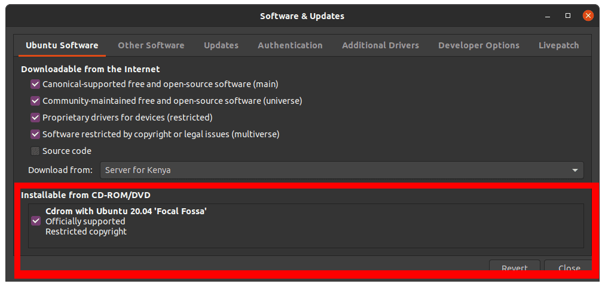
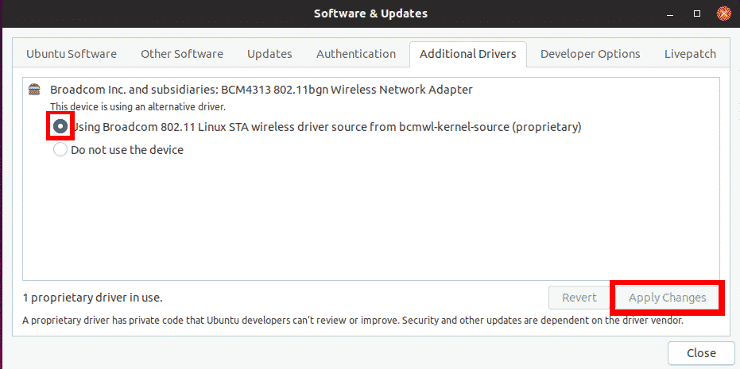

# Fix “No WiFi Adapter Found” Error on Ubuntu

A remarkable fact is that this method doesn’t require you to have an internet connection.

** Step 1. ** Copy the Ubuntu ISO image in your home directory. Rename it to a simple name like ‘ubuntu.iso.’

** Step 2. ** Launch the Terminal and mount the ISO image on the system like a CD/DVD.

```bash
sudo mkdir /media/cdrom
cd ~
sudo mount -o loop ubuntu.iso /media/cdrom
```
** Step 3. ** Now, launch the Software & Updates app from the applications menu.

** Step 4. ** Click on the Ubuntu Software tab and check the box ‘Installable from CD-Rom/DVD.’  A window will pop-up, and you will be required to enter the root password.


** Step 5. ** Click on the Additional Drivers tab. If you see the statement “No additional drivers available,” this Method won’t work for you. If you see the proprietary drivers listed, then you can go ahead.

Select the proprietary drivers and click the Apply Changes button. In my case, my system supports Broadcom drivers.

Once done, your wireless connection problem should be solved, and you can see your WiFi networks.


## Reference
> [https://www.fosslinux.com/43345/fix-the-no-wi-fi-adapter-found-error-on-ubuntu.htm](https://www.fosslinux.com/43345/fix-the-no-wi-fi-adapter-found-error-on-ubuntu.htm)